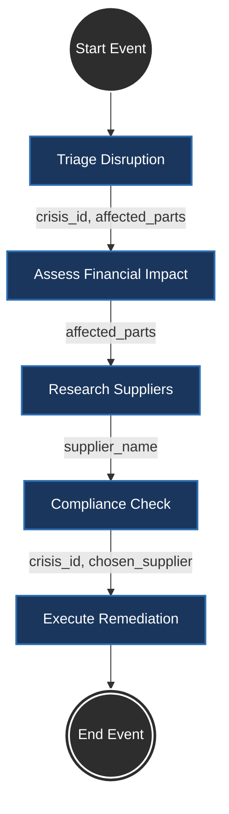

# Architecture du Flux UiPath Maestro (Agentic Workflow)

Ce document décrit la structure exacte du processus BPMN modélisé dans UiPath Maestro pour l'orchestration de notre API Aegis. 
Ce flux est 100% séquentiel.

## Diagramme BPMN

## Détail des paramètres dynamiques

Pour que l'orchestrateur soit autonome, les données transitent via les variables de sortie de chaque tâche (Output Body).

1. **Triage Disruption**
   - *Input* : JSON métier (ex: crise à Taiwan).
   - *Output* : Génère `crisis_id` et `affected_parts`.

2. **Assess Financial Impact**
   - *Input* : Récupère `{x} crisis_id` et `{x} affected_parts` depuis l'étape 1.

3. **Research Suppliers**
   - *Input* : Récupère `{x} affected_parts` depuis l'étape 1.
   - *Output* : Renvoie une liste de fournisseurs potentiels.

4. **Compliance & XAI Check**
   - *Input* : Récupère `{x} supplier_name` depuis le premier élément de la liste de l'étape 3.
   - *Output* : Valide les normes ESG et anti-fraude.

5. **Execute Remediation**
   - *Input* : Récupère `{x} crisis_id` depuis l'étape 1 et `{x} supplier_name` (validé) depuis l'étape 4.
   - *Action* : Lance la commande dans l'ERP.
