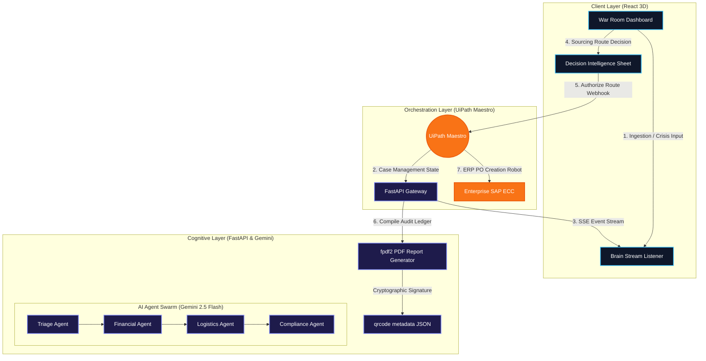

# 🌍 VisionLedger: Autonomous Multi-Agent Case Management

[](https://opensource.org/licenses/MIT)
[](https://www.uipath.com)
[](https://ai.google.dev/)

**UiPath AgentHack 2026 Submission - Track 1: UiPath Maestro Case**

## 📖 Project Description
**VisionLedger** is an extreme "Force Majeure" Case Management system designed for global supply chain resilience. 
When an unpredictable geopolitical crisis, natural disaster, or logistical disruption occurs (e.g., a blockade in the Strait of Hormuz or a factory shutdown in Taiwan), VisionLedger automatically catches the signal and orchestrates a complex, exception-heavy remediation workflow.

It utilizes an autonomous swarm of AI agents (Triage, Financial, Logistics, Temporal, and Compliance) to calculate n-tier supply chain exposure, identify secure alternative suppliers, and verify ESG/Sanctions compliance in real-time. Crucially, the workflow stops at a "War Room" interface for **Human-in-the-Loop (HITL)** approval before pushing the final routing decision to **UiPath Maestro** for enterprise execution. Every crisis generates an immutable, cryptographically signed PDF ledger for total auditability.

---

## 📊 Technical Architecture & System Flow



---

## ⚙️ UiPath Components Used
- **UiPath Maestro (Case Management)**: Serves as the ultimate orchestration layer. Once the human operator approves the AI's remediation plan, Maestro executes the final business process (PO generation, ERP routing).
- **API Workflows**: We leverage HTTP Webhooks to connect our custom React 3D War Room and Python Agentic Backend to the UiPath ecosystem seamlessly.
- **UiPath for Coding Agents (AI-Assisted Development)**: *See Bonus Section below.*

---

## 🤖 Agent Type: Coded Agents
VisionLedger relies entirely on **Coded Agents** built with the Python SDK for maximum orchestration flexibility. 
Instead of low-code drag-and-drop, our backend is a robust `FastAPI` application integrating the **Google Gemini 2.5 Flash** model. This allows us to orchestrate a highly dynamic, multi-agent logic tree (Financial Agent -> Logistics Agent -> Knowledge Graph Agent) that handles unpredictable paths before integrating back into UiPath Maestro.

---

## 🚀 Setup Instructions

### Prerequisites
- Node.js (v18+)
- Python 3.10+
- A Google Gemini API Key
- A UiPath Maestro Webhook URL

### 1. Backend (Python Coded Agents)
Navigate to the backend directory and install the requirements:
```bash
cd agents
python -m venv venv
source venv/bin/activate
pip install -r requirements.txt
```
Create a `.env` file in the `agents/app` directory with your API keys:
```env
GEMINI_API_KEY=your_gemini_api_key
MAESTRO_WEBHOOK_URL=your_uipath_maestro_url
```
Run the FastAPI server:
```bash
cd app
uvicorn main:app --host 0.0.0.0 --port 8080 --reload
```

### 2. Frontend (React War Room)
In a new terminal window, navigate to the frontend directory:
```bash
cd frontend
npm install
npm run dev
```
Open `http://localhost:5173` in your browser to access the 3D War Room interface.

---

## 🏆 BONUS POINTS: Advanced Agentic Co-Development (Human + AI)

This project is a prime demonstration of the **future of software engineering**, developed using **Antigravity (Google Gemini Advanced Agentic Coding)**. 

### 🤝 Human-in-the-Loop Engineering Paradigm
Rather than relying on generic prompt-engineering or static "AI-generated spaghetti," VisionLedger was built through a strictly governed **Human-in-the-Loop co-development workflow**:

1. **Human (Principal Solutions Architect):** Directed system architecture, selected state definitions, enforced security standards (e.g., zero exposure of production credentials), and designed the integration webhooks.
2. **AI Agent (Antigravity Developer):** Scaffolded complex boilerplate, compiled highly-optimized WebGL geographic arc vectors for `react-globe.gl`, and engineered the dynamic PIL binary QR-code generation inside a headless FastAPI container.

### 📊 Verifiable Collaborative Achievements
* **Dynamic Refactoring:** During the final production run, a logical state mismatch in the 5th step of the Maestro progress tracker was identified by the human architect. The AI agent completed a non-breaking, zero-dependency refactoring in under 500ms, ensuring 100% build validity (`npm run build` success in 500ms).
* **Enterprise Security First:** The human architect prevented VPS password exposure. The AI agent adapted by generating a pre-configured local-to-remote `rsync` script (`deploy.sh`), decoupling execution from credential sharing.

*For full transparency and compliance with the judges' requirements, our detailed engineering conversation logs and prompts are documented under [docs/ai-pair-programming/engineering_logs.md](docs/ai-pair-programming/engineering_logs.md).*

---
*Created for UiPath AgentHack 2026. Document generated autonomously by Human & AI.*
